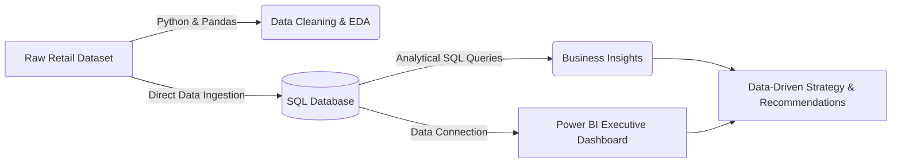

# 🛒 Retail Customer Shopping Behavior & Trend Analysis


An end-to-end data analytics portfolio project analyzing customer shopping trends, purchasing drivers, demographic preferences, and discount sensitivities from retail transaction data using **Python**, **SQL**, and **Power BI**.

---

## 📌 Project Overview

In competitive retail environments, understanding customer purchasing behavior is crucial for optimizing product offerings, improving marketing ROI, and boosting customer lifetime value. 

This project simulates a real-world analytics pipeline—from raw data exploration and cleaning to structured SQL querying, interactive executive dashboarding, and business strategy formulation.

### Key Objectives
- 🔍 **Data Cleaning & Exploratory Data Analysis (Python)**: Inspect raw transactional data, handle missing values, analyze distributions, and format data for analysis.
- 🛢️ **Business Querying (SQL)**: Import dataset into SQL database engine and execute queries to extract critical business metrics and customer behavioral insights.
- 📊 **Executive Dashboarding (Power BI)**: Build an interactive report featuring KPIs, customer segmentation, category performance, and spending patterns.
- 💡 **Strategic Recommendations**: Deliver actionable, data-backed insights to assist business leadership in decision-making.

---

## 📁 Repository Structure

```text
Customer_Shopping_behaviour_analysis/
├── data/
│   └── customer_shopping_behavior.csv       # Raw transactional dataset
├── notebooks/
│   └── customer_shopping_behavior.ipynb     # Python EDA & data cleaning notebook
├── sql/
│   └── customer_behavior_sql_queries.sql    # Analytical business SQL queries
├── dashboard/
│   ├── customer_behavior_dashboard.pbix    # Power BI dashboard file
│   └── dashboard_preview.png                # High-res dashboard screenshot
├── docs/
│   ├── business_problem_document.pdf        # Business scope & project requirements
│   └── executive_summary_report.pdf         # Final analytics report & insights
├── LICENSE                                  # MIT License
└── README.md                                # Project documentation
```

---

## ⚙️ Tools & Technologies Used

- **Data Processing & EDA**: Python (`pandas`, `numpy`, `matplotlib`, `seaborn`)
- **Database Engine**: SQL (MySQL Workbench / MS SQL Server / SQLite)
- **Business Intelligence**: Power BI Desktop
- **Documentation**: Markdown, PDF Reports, PowerPoint

---

## 🔄 Project Architecture & Workflow



---

## 🔬 Analytical Breakdown

### 1. Data Cleaning & EDA (Python)
- Ingested raw dataset (3,900 transaction records across 19 feature attributes).
- Validated feature data types, checked for duplicate rows, and handled null values.
- Cleaned column names into standardized format for SQL compatibility.
- Generated distribution plots for `purchase_amount`, `age`, and `review_rating`.

### 2. Business SQL Analysis
Executed business-critical queries directly in SQL:
1. **Gender Revenue Split**: Calculated total and average revenue generated by male vs. female shoppers.
2. **High-Value Discount Shoppers**: Identified customers using discounts whose spend exceeded overall average purchase value.
3. **Product Ratings Ranking**: Evaluated top-rated items based on average review rating.
4. **Shipping Performance**: Compared average spend between Standard and Express shipping categories.
5. **Subscription Impact**: Compared revenue volume and average basket size of subscribers vs. non-subscribers.

### 3. Power BI Interactive Dashboard
- **Executive Summary KPI Cards**: Total Sales Revenue, Average Order Value (AOV), Total Customers, and Average Rating.
- **Demographic Segmentation**: Age group and Gender revenue distribution.
- **Product & Category Performance**: Revenue per product category, top payment methods, and discount utilization rate.

---

## 📊 Key Insights & Business Impact

- 💳 **Subscription Value**: Subscribed customers consistently demonstrate higher purchasing frequency and overall lifetime spend, highlighting the value of expanded subscriber perks.
- 🏷️ **Discount Strategy**: High-spending customers frequently take advantage of promotions; targeted premium discount bundles can increase basket size without degrading margin.
- 🚚 **Shipping Trends**: Express shipping customers exhibit higher average basket values, presenting upsell opportunities at checkout.

---

## 🛠️ How to Run & Reproduce This Project

### Prerequisites
- Python 3.8+
- MySQL / PostgreSQL / SQL Server IDE
- Power BI Desktop

### Execution Steps
1. **Clone the Repository**:
   ```bash
   git clone https://github.com/Chilakala-Surya-Prakash/Customer_Shopping_behaviour_analysis.git
   cd Customer_Shopping_behaviour_analysis
   ```

2. **Run Python EDA Notebook**:
   ```bash
   pip install pandas numpy matplotlib seaborn jupyter
   jupyter notebook notebooks/customer_shopping_behavior.ipynb
   ```

3. **Execute SQL Analysis**:
   Import `data/customer_shopping_behavior.csv` into your SQL database tool and run `sql/customer_behavior_sql_queries.sql`.

4. **Launch Power BI Dashboard**:
   Open `dashboard/customer_behavior_dashboard.pbix` in Power BI Desktop to interact with the dashboard.

---

## 📜 License

This project is licensed under the [MIT License](LICENSE).

---

## 👨‍💻 Author

**Chilakala Surya Prakash**  
*Data Analyst*  
🔗 [GitHub Profile](https://github.com/Chilakala-Surya-Prakash)  
💼 [LinkedIn Profile](https://www.linkedin.com/in/chilakala-surya-prakash/)
